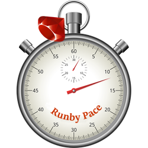

# RunbyPace

RunbyPace contains the core logic for calculating the target "paces" used by runners. By "runners" I mean  the common
 humanoid biped variety, complete with oscillating appendages and prolific perspiration. :)

| | |
| --- | --- |
| **Build** | [](https://travis-ci.org/tygerbytes/runby-pace) |
| **Grade** | [](https://www.codacy.com/app/tygerbytes/runby-pace?utm_source=github.com&utm_medium=referral&utm_content=tygerbytes/runby-pace&utm_campaign=badger) |
| **Coverage** | [](https://coveralls.io/github/tygerbytes/runby-pace?branch=master) |
| **Gem** | [](https://rubygems.org/gems/runby_pace) |

[](https://travis-ci.org/tygerbytes/runby-pace/builds)

Any sort of running program will include runs at varying paces, easy runs, distance runs, tempo runs, long runs, and
 then the gambit of "interval" type runs, such as 1500m pace repetitions, 5K and 10K pace reps, cruise intervals, and
 so on. Many runners typically consult pace tables based on their most recent time for a 5K race. So assuming your most
 recent 5K time was 20 minutes, and you're supposed to run a "long run", you find your most recent 5K time in the
 Long Run table, and it tells you that you should try to maintain a pace of 5:30-6:19 minutes per kilometer.

So this is great, but a little tedious. RunbyPace automates this whole process by calculating all of the paces for you.
 All you need is your current 5K time and some Ruby, and you're off running at just the right pace.

RunbyPace also encapsulates the logic and math necessary for many running-related calculations based on time, pace, speed, unit coversions, etc. If you're tired of constantly converting minutes and seconds to decimal and back again, RunbyPace is for you.

[](https://runbypace.com)

## Installation

Add this line to your application's Gemfile:

```ruby
gem 'runby_pace'
```

And then execute:

    $ bundle

Or install it yourself:

    $ gem install runby_pace

## Usage

I plan to craft better docs in the future, but for now the **specs** make for excellent class usage documentation: https://github.com/tygerbytes/runby-pace/tree/master/spec/runby_pace

For a live front end written in **Rails**, see https://runbypace.com. It's code will be open-sourced as well, as soon as we can guarantee secure deployment.

For an open-source example front end written in **Elm**, see https://github.com/tygerbytes/pacebyelm

The CLI is still in its infancy, but the gem comes with a basic CLI/REPL (`bin/runbypace`)

## Development

After checking out the repo, run `bin/setup` to install dependencies. Then, run `rake spec` to run the tests. You can also run `bin/console` or `bin/runbypace` for an interactive prompt that will allow you to experiment.

To install this gem onto your local machine, run `bundle exec rake install`.

## Contributing

Bug reports and pull requests are welcome on GitHub at https://github.com/tygerbytes/runby-pace.

Contribute front-end and CLI ideas at [@runbypace](https://twitter.com/runbypace).

## Acknowledgements

Crafted with care, with the support of [JetBrains RubyMine](https://www.jetbrains.com/ruby/)

[](https://www.jetbrains.com/ruby/)


## License

The gem is available as open source under the terms of the [MIT License](http://opensource.org/licenses/MIT).
